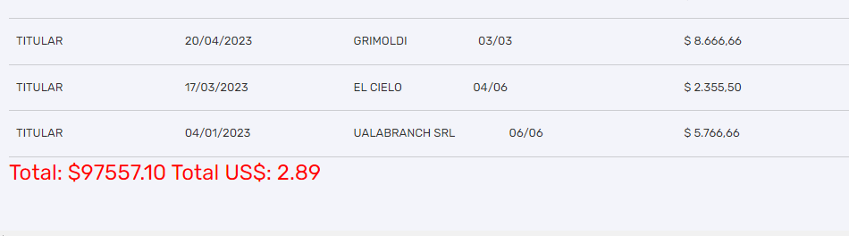

# Extension banco de Entre Rios

Permite sumar el total consumido de tarjeta de credito en el mes corriente 

Instalacion.

1. Ir a gestionar extension y activar el modo desarrollador.
2. Seleccionar la opcion Cargar Descomprimida
3. Seleccionar el directorio raiz de la extension.

